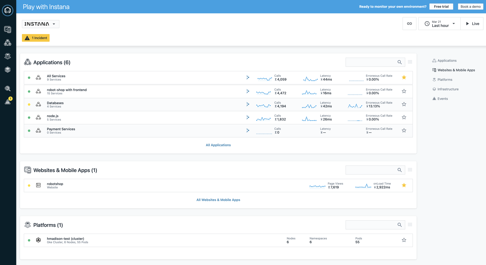
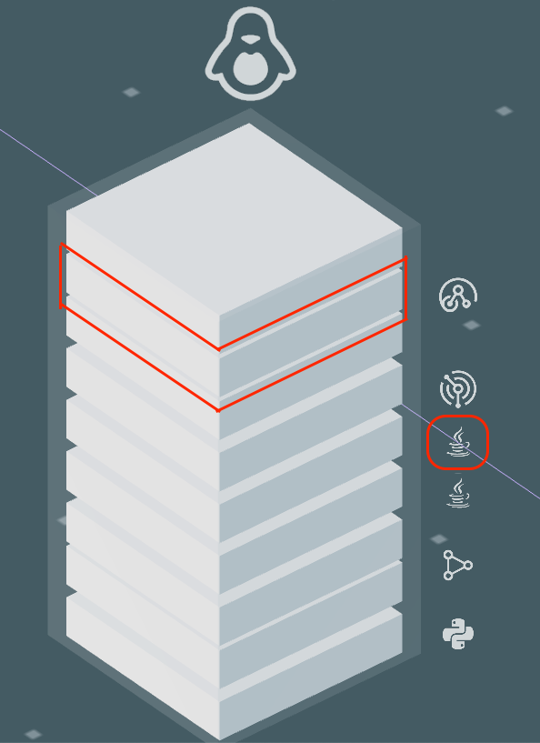
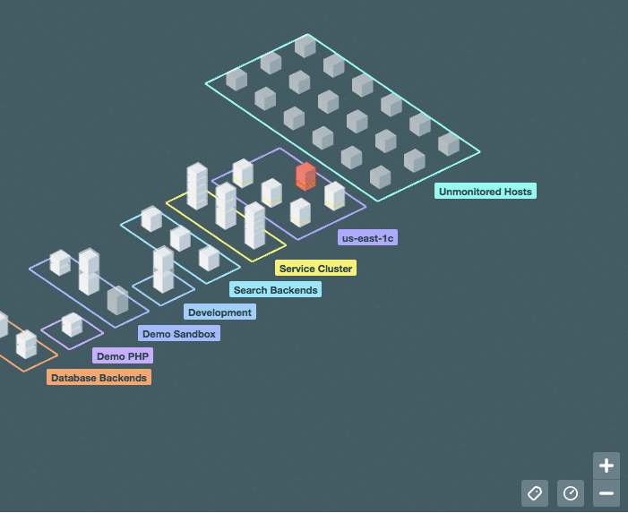
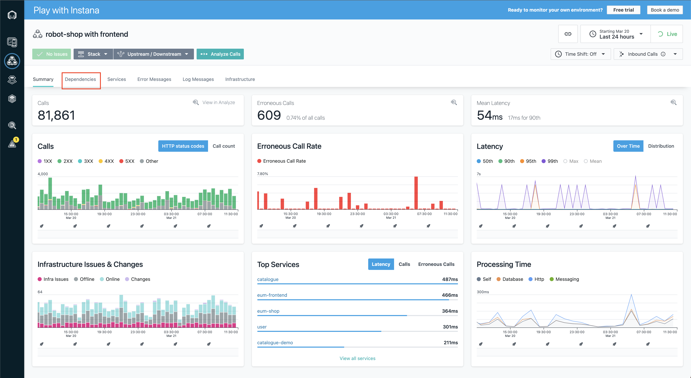

# 101: Interfaz de Usuario (IU) de Instana

## Objetivo

El objetivo de este laboratorio es ayudar a explorar / familiarizarse con algunas capacidades clave disponibles a través de la interfaz de usuario de Instana, específicamente el monitoreo de Kubernetes y servicios.

## Iniciar sesión en la interfaz de usuario

Por coherencia del laboratorio, utilizaremos un ambiente compartido de sólo lectura ubicado en: [https://play-with.instana.io](https://play-with.instana.io)

1. Se le pedirá que dé una dirección de correo electrónico para obtener acceso al espacio virtual. Escriba la dirección de su trabajo o cualquier otra dirección que le parezca bien compartir.

   

2. Una vez completado, debería ver la vista predeterminada del panel de Play-With-Instana

   

## Exploración de la vista de infraestructura

Ahora que ha iniciado sesión en el sandbox, vamos a dedicar un poco de tiempo a examinar la vista **Infrastructure** siguiendo los siguientes pasos:

1. Haga clic en el icono _**Infrastructure**_ situado a la izquierda del panel de navegación.

   

   Observe la visualización en 3D de los distintos componentes de su infraestructura.

Esta vista ofrece una visión general de todos los sistemas monitorizados, agrupados en zonas de rectángulos 3D (tridimensionales)

Desde la vista de pájaro, cada zona consiste de pilares, y cada pilar representa un agente de Instana ejecutándose en un sistema respectivo.
En la imagen de ejemplo anterior y en su sandbox, los pilares representan nodos trabajadores para un cluster GKE Kubernetes.

Instana es capaz de visualizar toda esta información gracias al gráfico dinámico y su compatibilidad con más de 250 tecnologías de sensores.

Al hacer zoom en el pilar, se pueden ver las cajas más pequeñas _(cajas de pizza)_ que componen el pilar general más grande. Cada una de estas cajas más pequeñas representa una entidad o una tecnología de sensor que Instana ha descubierto y está monitorizando; Instana no sólo monitoriza cada entidad sino que también proporciona información asociada, representada como una pequeña pila, como la tecnología utilizada para una entidad dada.

## Filtrado

En ambientes virtuales grandes, puede ser difícil encontrar el servidor o la zona que está buscando. Afortunadamente, hay varias formas de buscar dentro de la vista _Infrastructure_.

Imagine que está monitorizando cientos de servicios, servidores y puntos finales. Mientras que Instana, sería capaz de ofrecer fácilmente la observabilidad para todos ellos, sería demasiado si sólo estás buscando servicios o servidores con altos ciclos de CPU.

La respuesta a este problema es cambiar la vista utilizando los iconos de Vista de etiquetas, Vista de métricas agregadas, Vista de métricas y 3D, y alternar entre tablas. En este caso, exploraremos la vista Métrica.

## Vista de métricas

Estas vistas de métricas permiten ver fácilmente las métricas útiles como parte de la vista más amplia de la infraestructura.

1.  Estas vistas de métricas permiten ver fácilmente las métricas útiles como parte de la vista más amplia de la infraestructura.

2.  Cicle a través de todas las diferentes métricas

    1. CPU Load

    2. CPU Usage

    3. Free Memory

3.  Para restablecer la vista de métricas y volver a la vista de componentes, haga clic en el icono de métricas y seleccione reset en la esquina inferior derecha.

    

    _**Observación**: En la vista de métricas, el icono de métricas se resaltará mientras haya una métrica seleccionada para recordarle que está activada._

    Además de las opciones proporcionadas en la leyenda de abajo a la derecha, Instana también hace uso del lenguaje de búsqueda _lucene_ en la barra de filtro/búsqueda en la parte de arriba de la página mientras estamos en la vista de Infraestructura. Podemos hacer uso de esta barra de búsqueda para filtrar entidades y profundizar en servicios o puntos finales específicos. Antes de iniciar la búsqueda, sitúe el cursor sobre una de las torres e identifique el nombre de host de uno de los servidores. Por ejemplo `geke.<nombre de host completo>`.

## Consulta / Búsqueda

Probemos una consulta buscando un host específico

1.  Haga clic en la barra de filtros y seleccione "Entity".

2.  En la lista desplegable, escriba _host_ y verá la lista filtrada a "host". Una vez que vea la única entrada, seleccione host.

3.  Debería ver _entity.host.name:_. Después del ":", puedes hacer una búsqueda con comodines. Por ejemplo, "entidad.nombre.host:_abc_". Escriba una cadena de caracteres comodín que coincida con el principio del nombre de host que desea buscar. Especificaremos "entity.host.name:\*gke\*" para filtrar sólo los servidores GKE.

4.  Una vez que haya especificado el filtro, verá que la vista de la infraestructura se filtra a sólo un conjunto de servidores GKE que coincide con su búsqueda.

5.  A continuación vamos a escribir otra consulta para filtrar las entidades dentro de una zona específica. Escriba "entity.zone:\*_eu_\*" como la búsqueda de consulta y observe que ya no vemos los servidores GKE, sino sólo una única entidad AWS ubicada en la zona `eu`.

    

_**Observación**: el filtro de búsqueda acepta muchas consultas diferentes, incluidas las condiciones AND, OR y NOT. Puede encontrar más información sobre el lenguaje de consulta lucene aquí (https://www.ibm.com/docs/en/instana-observability/current?topic=instana-filtering-dynamic-focus)_

6.  Borre el filtro de la parte superior de la página haciendo clic en la _x_ antes de pasar a la etapa siguiente.

## Gráfico de dependencia

Ahora echemos un vistazo a otra característica clave de Instana, el descubrimiento automatizado de dependencias gracias en parte a la característica Dynamic Graph que forma parte de Instana.

1.  Para empezar, seleccione el icono Aplicaciones en el menú de navegación de la izquierda

    

2.  A continuación seleccione `robot-shop with frontend` de la lista de aplicaciones disponibles, una vez completado debería tener una vista de la aplicación por default como la que se muestra a continuación. A continuación, seleccione la pestaña `Dependencies` tab

    

3.  Vea las dependencias de las aplicaciones de la tienda robótica descubiertas por Instana. Las llamadas entre servicios y puntos finales se representan mediante líneas, y el tráfico en directo se representa visualmente como puntos en movimiento a lo largo de la conexión.

<QuizAlert text="Hay una pregunta de prueba relacionada con las dependencias." /> 

4.  Al visualizar un servicio específico para su aplicación, observe que las conexiones a otros servicios aparecen oscurecidas, lo que le permite centrarse en el servicio o las conexiones que le interesa investigar.

<QuizAlert text="Hay una pregunta de prueba relacionada con las dependencias." /> 
