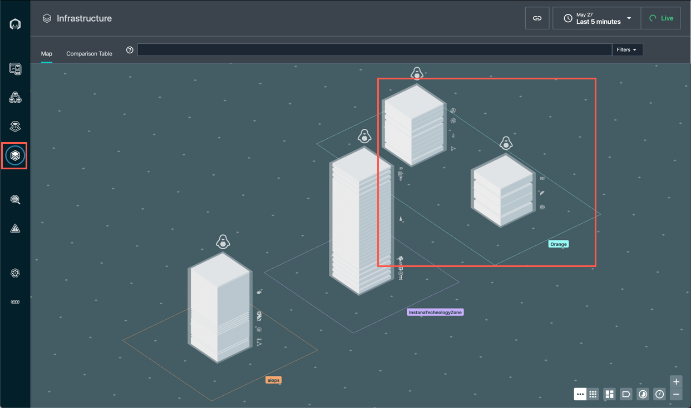
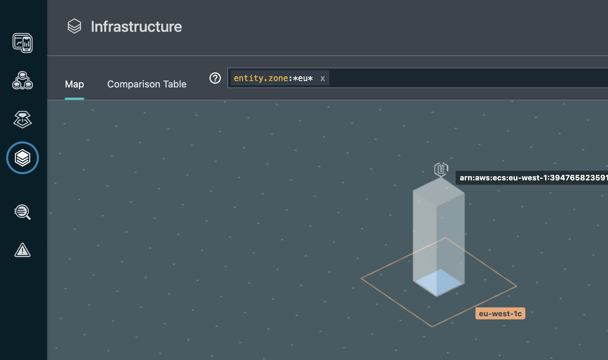
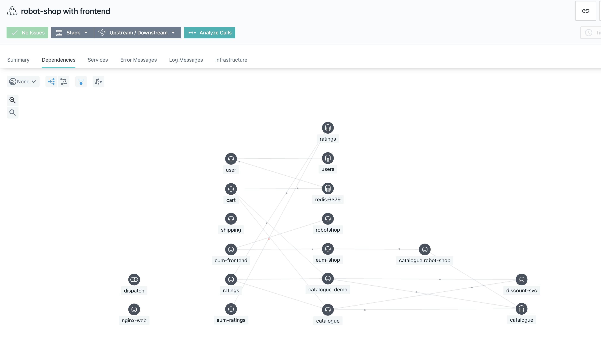

# 101: Instana UI

## Goal

The goal of this lab is to help explore / familiarize yourself with some key capabilities available in through the Instana UI, specifically monitoring of Kubernetes and services.

## Logging into the UI

For lab consistency, we will all make use of a shared read-only environment located at: [https://play-with.instana.io](https://play-with.instana.io)

1. You will be requested to provide an email in order to gain access to the sandbox, type in your work email or any email you are comfortable with sharing

   

2. Once complete, you should see the default view for the Play-With-Instana sandbox dashboard

   

## Exploring the Infrastructure View

Now that you have logged into the sandbox, we will spend a bit of time examining the **Infrastructure** View using the following steps:

1. Click on the _**Infrastructure**_ icon on the left hand side of the navigation panel.

   

   Notice the 3D visualization of the different components for your infrastructure.

   This view provides an overview of all the monitored systems, grouped into zones of 3D (three-dimensional) rectangles

   From the birds-eye view, each zone consists of pillars, and each pillar represents an Instana agent running on a respective system.
   In the example image above and in your sandbox, the pillars represent worker nodes for a GKE Kubernetes cluster.

   Instana is able to visualize all of this information thanks to the Dynamic Graph and its support for over 250+ sensor technologies.

   As you zoom in to the pillar, you can see the smaller boxes _(pizza boxes)_ that make up the larger overall pillar. Each one of these smaller boxes represent an entity, or a sensor technology that Instana has discovered and is monitoring; Instana not only monitors each entity, but also provides associated information, represented as a small stack, such as the technology used for a given entity.

   

## Filtering

In large environments, it can be difficult to find the server or zone that you are looking for. Fortunately, there are a number of ways that you can search for things within the _Infrastructure view_.

Imagine you are monitoring hundreds of services, servers, and endpoints. While Instana, would be able to easily provide observability for all of them, it would be overwhelming if you are only looking for services or servers with high CPU cycles.

The answer to this problem is to change the view using the icons for Tag View, Aggregate Metric View, Metric View & 3D, and Table toggle. In this case, we will be exploring the Metrics view.

## Metrics View

These metrics view allow for one to easily view useful metrics as part of the broader infrastructure view.

1.  From the bottom right-hand corner try changing the default view to show the aggregate CPU cycle time
2.  Cycle through all the different metrics

    1. CPU Load

    2. CPU Usage

    3. Memory Used

3.  Reset the metric view and return to the default component view by clicking the metrics icon and select reset in the lower right corner.

    

    _**Note**: While in the metrics view, the metrics icon itself will be highlighted as long as a metric is selected to remind you that it is turned on._

    In addition to the options provided in the lower right-hand legend, Instana also makes use of the _lucene query language_ in the filter/search bar at the top of the page while in the Infrastructure view. We can make use of this search bar to filter entities and drill down to specific services or endpoints. Before beginning the search, hover on one of the towers and identify the hostname of one of the servers. For example `geke.<fully qualified hostname>`

## Query / Search

Let's try out a query by looking for a specific host

1.  Click in the filter bar and select "Entity"

2.  From the dropdown-list start typing _host_ and you will see the list filtered to "host". Once you see the single entry, select host.

3.  You should see _entity.host.name:_. After the ":", you can do a wildcard search. For example "entity.host.name:_abc_". Type in a wildcard string that matches the beginning of the hostname you want to look for. We will specify "entity.host.name:\*gke\*" to filter only the GKE servers.

4.  One you have specified the filter, you'll see that the infrastructure view is filtered to just a set of GKE servers that matches your search.

5.  Next we will type out another query to filter out entities within a specific zone. Type out "entity.zone:\*_eu_\*" as the query search and notice we no longer see the GKE servers, but only a single AWS entity located in the `eu`

    

    _**Note**: the search filter engine supports many different queries, including AND, OR, and NOT conditions. More info on the lucene query language can be [found here](https://www.ibm.com/docs/en/instana-observability/current?topic=instana-filtering-dynamic-focus)_

6.  Clear the filter at the top of the page by clicking on the _x_ before moving onto the next step.

## Dependency Graph

Now lets take a look at another key Instana feature, automated discovery of dependencies thanks in part to the Dynamic Graph feature that is part of Instana

1.  Start by selecting the Applications icon from the left hand navigation menu

    

2.  Next select the `robot-shop with frontend` from the list of available applications, once complete you should have a default application view like the one below. Then select the `Dependencies` tab

    

3.  View the robot-shop application dependencies as discovered by Instana. Calls between services and endpoints are represented via lines, and the live traffic is visually represented as moving dots along the connection. 🟢

    

4.  When viewing a specifc service for your application, note that the connections to other services are dimmed, allowing you to focus on the service or connections that you are interested in investigating. 🟢

    
