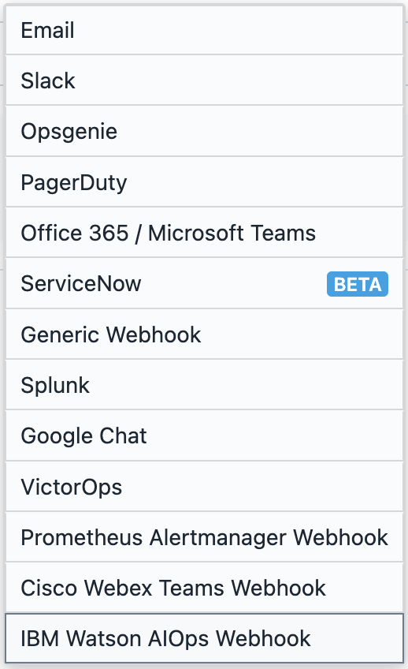
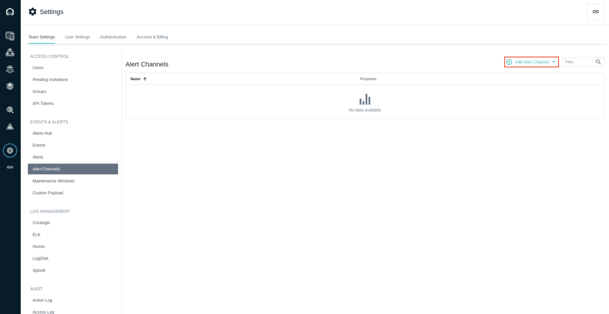
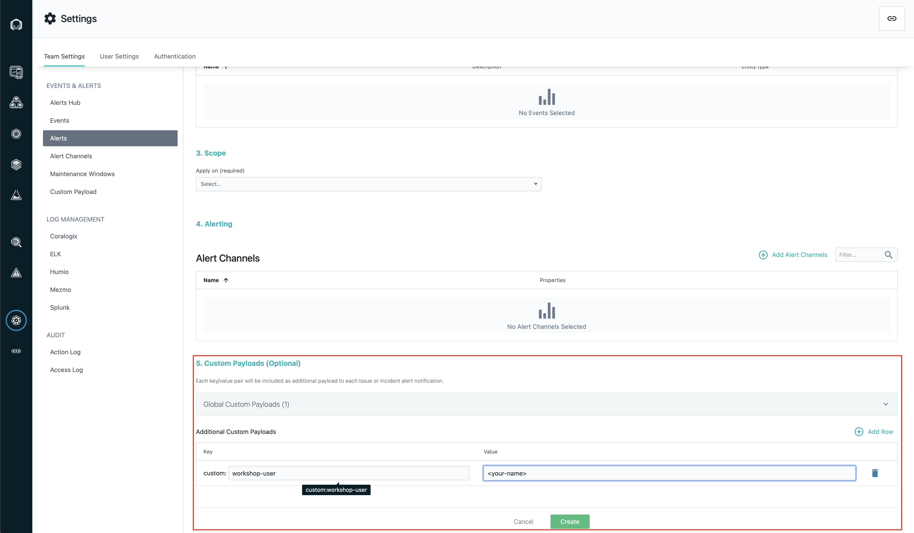

# 103: Alerta y sintéticos

## Alertas

Instana es compatible con 13 tecnologías para [canales de alerta](https://www.ibm.com/docs/en/instana-observability/current?topic=apis-alerting#alerting-integrations). A continuación se muestra la lista completa de tecnologías disponibles:

## Añadir _Slack_ como canal de alerta

Para crear alertas, primero necesitamos crear un canal de alertas. Este es un proceso sencillo que consiste en añadir un webhook entrante a _Slack_ para un canal _Slack_ específico. Para evitar que cada persona cree un nuevo canal, utilizaremos uno existente para este laboratorio.

En su espacio de trabajo de Slack proporcionado, únase al canal **\#instana-alerts** en _Slack_.

Para la URL del Webhook, busque el mensaje fijado en el canal **\#instana-alerts** que contendrá la URL.

## Crear un canal de alerta

1. En la barra lateral izquierda de navegación, haz clic en la sección **Configuración**.

2. En la página **Configuración**, en la barra lateral izquierda de navegación, haga clic en la sección _Canales de Alerta_. A continuación, haga clic en el campo **Añadir canal de alerta** y seleccione **Slack**.

   

3. En la página recién abierta **Crear canal de alertas de Slack**, rellene la información solicitada con los siguientes datos;
   
     - Nombre**: `<su_nombre>-slack-channel`.
     - URL del Webhook**: _Referencia al mensaje anclado en el canal **\#instana-alerts** de su espacio de trabajo Slack_.
     - URL del icono** (opcional): _Puede dejarse en blanco o proporcionar una URL de imagen de icono PNG para diferenciar las alertas de su canal de Slack_
     - Nombre del canal**: `instana-alerts`

   
   Una vez completado, pulse **Probar canal** para asegurarse de que todo está configurado correctamente, debería ver un cuadro verde que indica una prueba de canal con éxito. Pulse "Crear" para crear su nuevo canal de alertas.

   
## Enviando eventos específicos al canal

Con los canales ya creados, podemos decidir qué alertas queremos enviar a _Slack_. Para esta demostración, enviaremos todas las incidencias de `robot-shop` al canal _Slack_.

1. En la barra lateral de navegación de la izquierda, haga clic en la sección **Settings**.

2. En la página **Settings**, en la barra lateral de navegación de la izquierda, haga clic en la sección _Alerts_ que se encuentra justo encima de los Canales de alerta. A continuación, haga clic en el botón **New Alert**.

3. Para el nombre utiliza este pattern, `<tu-nombre>-alert`.

4. En **Eventos**, elija la opción **Alertar sobre tipo(s) de evento(s)** y, a continuación, active todas las opciones. Esto nos permitirá mostrar cómo se muestran los diferentes eventos en _Slack_.

   

5. En **Scope**, elija la opción **Application Perspective** y, a continuación, seleccione la opción **Add Application Perspectives**. A continuación, **Select All** las opciones.

_Observación: Si utiliza Instana para observar varias aplicaciones, puede añadir alertas de varias aplicaciones diferentes a la vez, o puede crear varias alertas, una para cada perspectiva._

6. En Canales de Alerta, seleccione el canal que creó en los pasos anteriores **<su-nombre>-slack-channel**.

7. En la sección `Custom Payloads`, haz clic en **Add Row** e introduce `workshop-user` para la *key* personalizada; para el *value* introduce tu nombre o algo que te identifique de forma única como tus iniciales. Dado que todos vamos a utilizar el mismo canal de Slack para este laboratorio, estas cargas útiles personalizadas podrán ayudarnos a identificar qué eventos pertenecen a qué instancia de Instana.

   

8. Una vez completado, haga clic en **Crear**. Este canal permitirá a Instana publicar en el canal **\#instana-alerts** _Slack_. Espere unos minutos y busque eventos en el canal **\#instana-alerts** de Slack, asegúrese de buscar eventos que contengan su carga útil personalizada para identificar de forma exclusiva los eventos de su instancia de Instana.

Ya está. Ahora, a medida que se generen eventos desde Instana, serán enviados al canal _Slack_. Este potente y flexible método de alerta permite alertas específicas, tales como el uso de diferentes canales _Slack_ para alertas de diferente gravedad, o incluso enviar a los desarrolladores de PagerDuty los problemas críticos a medida que surgen.

## Sintéticos

Los sintéticos son una novedad en Instana. Permiten simular experiencias de usuario en su aplicación y monitorizar varias características de rendimiento.

Aviso: Synthetics sólo está disponible en una instancia SaaS, no on-prem.

Aunque está fuera del alcance de este laboratorio, dado que estamos utilizando instancias de Instana on-prem, aquí se proporcionan instrucciones para ayudarle en el futuro, en caso de que decida probar esta función en la versión SaaS de Instana.

En esta sección crearemos pruebas sintéticas para monitorizar nuestra aplicación. Para crear una prueba sintética, primero debe tener un Punto de Presencia (PoP) instalado y en funcionamiento. Múltiples PoPs pueden ser desplegados en clusters en varias regiones geográficas para simular la experiencia del usuario en esas regiones. Las instrucciones para instalar PoPs se pueden encontrar [aquí.](https://www.ibm.com/docs/en/instana-observability/current?topic=beta-pop-deployment) Esto está fuera del alcance de este laboratorio, y utilizaremos un PoP existente ya registrado en el panel de Instana.

1. En la instancia de Instana SaaS ([https://sandbox-partner.instana.io/#/home](https://sandbox-partner.instana.io/#/home)), vaya a **Synthetic Monitoring** en el menú de navegación de la izquierda y haga clic en **Create New Test**.

2. Para familiarizarnos con la funcionalidad, crearemos un sintético de ping.

   En **Paso 2: Solicitar detalles** añada la URL para la región específica de su solicitud y elija **synthetic-dc** como Punto de Presencia. Haga clic en Siguiente.

   

3. Para la Frecuencia elija 1 Minuto, y haga clic en Siguiente.

   

4. Nombre su sintético utilizando este modelo `<su nombre>-synthetic`, y escriba una descripción opcional. Marque **All Services** y haga clic en el botón **Create**.

   

Ahora puede ver los análisis y métricas de su prueba sintética en la lista **Tests**.
