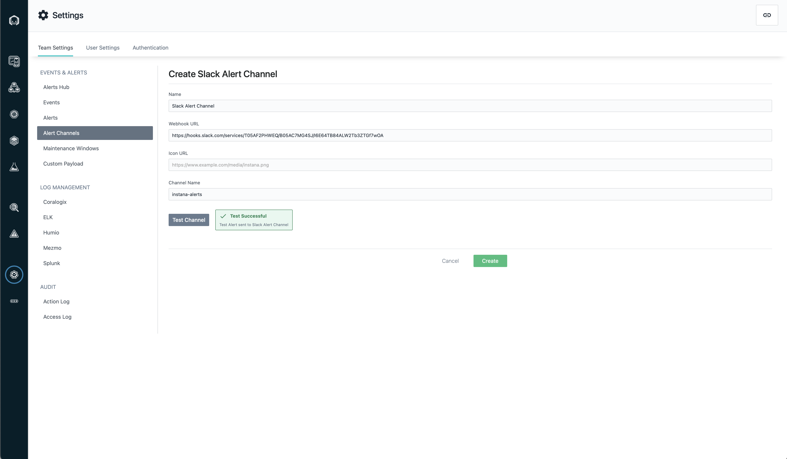
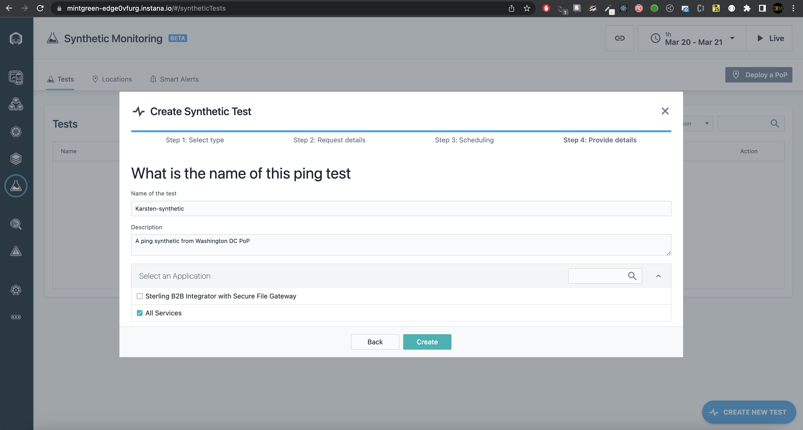

# 103: Alerting and Synthetics

## Alerting

Instana currently supports 13 technologies for [alert channels](https://www.ibm.com/docs/en/instana-observability/current?topic=apis-alerting#alerting-integrations). The full list of available technologies is below:

## Adding _Slack_ as an alert channel

In order to create alerts, we first need to create an alert channel. This is a simple process that involves adding an incoming webhook to _Slack_ for a specific _Slack_ channel. To avoid having each person create a new channel, we will just use an existing one for this lab.

In your provided Slack Workspace please join the **\#instana-alerts** channel in _Slack_.

For the Webhook URL, look for the pinned message in the **\#instana-alerts** channel that will contain the URL.

## Creating an alert channel

1. In the left-hand navigation sidebar, click on the **Settings** section.

2. In **Settings** page, on the left-hand navigation sidebar, click on the _Alert Channels_ section. Then click on the **Add Alert Channel** field and select **Slack**.

   

3. From the newly opened **Create Slack Alert Channel** page, fill out the requested information using the following details;
   
     - **Name**: `<your-name>-slack-channel`
     - **Webhook URL**: _Refer to the pinned message in the **\#instana-alerts** channel in your Slack workspace_
     - **Icon URL** (optional): _Can be left blank or provide an PNG icon image URL to differentiate your Slack channel alerts_
     - **Channel Name**: `instana-alerts`

   
   Once complete, hit **Test Channel** to ensure everything is setup correctly, you should see a green box indicating a successful channel test. Hit `Create` to create you new Alert Channel

   
## Sending specific events to the channel

With the channels already created, we can proceed to decide which alerts we want to push to _Slack_. For this demo we will push all `robot-shop` issues to the _Slack_ channel.

1. In the left-hand navigation sidebar, click on the **Settings** section.

2. In **Settings** page, on the left-hand navigation sidebar, click on the _Alerts_ section which is just above the Alert Channels. Then click on the **New Alert** field

3. For the name use this pattern, `<your-name>-alert`

4. Under **Events**, choose the **Alert on Event Type(s)** option, and then toggle all of the options. This will allow us to showcase how different events show up in _Slack_.

   

5. Under **Scope**, choose the **Application Perspective** option, and then select the **Add Application Perspectives** option. Then **Select All** of the options.

   _Note: If you are using Instana to observe multiple applications, you can add alerts from multiple different applications at once, or you can create multiple alerts, one for each perspective._

   

6. Under Alert Channels, select the channel you created in the earlier steps **<your-name>-slack-channel**

7. In the `Custom Payloads` section, click **Add Row** and enter `workshop-user` for the custom *key*; for the *value* enter your name or something that uniquely identifies you such as your initials. Since we will all be using the same Slack Channel for this lab, these custom payloads will be able to help us identify which events belong to whose Instana instance.

   

8. Once complete click **Create**. This channel will allow Instana to post to the **\#instana-alerts** _Slack_ channel. Wait a few minutes and watch for events within the **\#instana-alerts** Slack channel, be sure to watch for events that contain your custom payload to uniquely identify the events from your Instana instance.

That's it! Now as events are generated from Instana, they will be pushed to the _Slack_ channel. This powerful, flexible alerting method allows for need specific alerting, such as using different _Slack_ channels for alerts of different severity, or even paging out developers from PagerDuty for critical issues as they arise.

## Synthetics

Synthetics are brand new in Instana! They allow for simulated user experiences in your application, and monitoring for various performance characteristics.

_Note: Synthetics are only available in a SaaS instance, not on-prem._

While outside the scope of this lab, given that we are using on-prem Instana instances, directions are provided here to help support you in the future, should you decice to try out this feature within the SaaS version of Instana.

For this section we will be creating synthetics to monitor our application. In order to create a synthetic test, you must first have a Point of Presence (PoP) installed and running. Multiple PoPs can be deployed to clusters in various geographic regions to simulate user experience for those regions. Instructions for deploying PoPs can be found [here.](https://www.ibm.com/docs/en/instana-observability/current?topic=beta-pop-deployment) This is out of scope for this lab, and we will be using an existing PoP already registered in the Instana dashboard.

1. In the Instana SaaS instance ([https://sandbox-partner.instana.io/#/home](https://sandbox-partner.instana.io/#/home)) navigate to **Synthetic Monitoring** in the left-hand side navigation, and click on **Create New Test**.

   

2. To get familiar with the functionality, we will create a ping synthetic.

   Under **Step 2: Request Details** add URL for the specific region of your application and choose **synthetic-dc** as the Point of Presence. Click Next.

   

3. For Frequency choose 1 Minute, and then click next.

   

4. Name your synthetic using this pattern `<your name>-synthetic`, and provide an optional description. Check **All Services** and then click the **Create** button.

   

You can now view your synthetic test analytics and metrics under the **Tests** list
