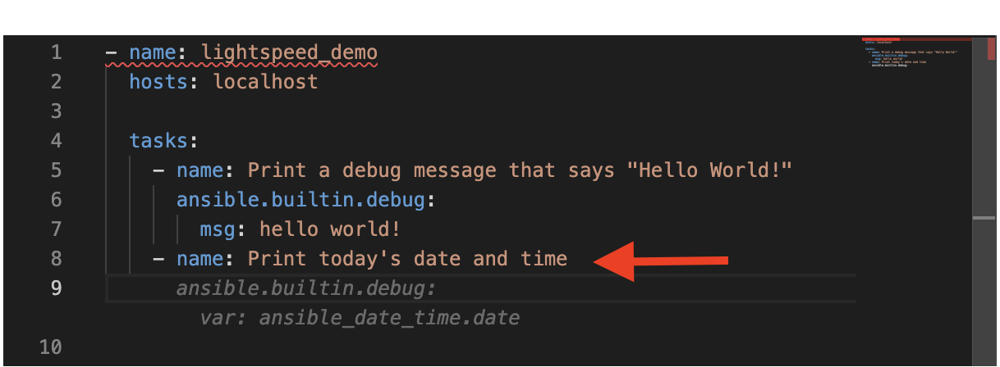
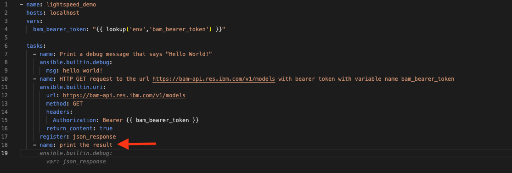

# 102: Asistente de código IBM Watsonx

## Objetivo

El objetivo de este laboratorio es ayudar a explorar/familiarizarse con algunas capacidades clave disponibles en Watsonx Code Assistant (WCA).

## Introducción

Watsonx Code Assistant utiliza un modelo base gestionado por el equipo de IBM Research y entrenado en [Ansible Galaxy](https://galaxy.ansible.com/), [GitHub](https://github.com/), y otras fuentes abiertas de datos. 

El modelo ofrece acceso a recomendaciones de contenido de Ansible mediante el uso de descripciones de automatización en lenguaje natural. 

El modelo está disponible a través de una extensión de Visual Studio Code (VS Code) llamada **Ansible Lightspeed** con [IBM watsonx Code Assistant](https://www.ibm.com/products/watsonx-code-assistant).

## Cómo obtener una recomendación de Ansible Lightspeed

1. Crea un nuevo playbook de Ansible creando un nuevo archivo llamado `ping.yml`.

    a. Seleccione **Archivo > Nuevo archivo de texto**.

    

    b. Haga clic en **Seleccionar un idioma** en el nuevo archivo y aparecerá un menú desplegable y seleccione **Ansible**. 

    

    c. Guarde el archivo y nómbrelo `lightspeed-demo` con una extensión YAML (`.yml` o `.yaml`)

2.  En la esquina inferior derecha, deberías ver **Lightspeed**. Ansible Lightspeed está listo para que escribas playbooks.

    **Nota:** Comprueba que tu entorno Python también está seleccionado.

    
3. Añade una nueva tarea Ansible con un nombre en inglés sencillo que diga `Print debug message that says "Hello World!"`.

    Una vez que pulses la tecla *Enter*, la sugerencia aparecerá como texto difuminado. 
    
    Lightspeed recomendará código basado en el texto que escribiste en el campo nombre en la sección playbook.

    

4. Puedes aceptar la recomendación pulsando la tecla *Tab*.

    

5. Añadamos una segunda tarea a nuestro Playbook. Escribe una frase en un nuevo campo `name` que diga `Print today's date and time`.

    

6. Pulse la tecla *Esc* para rechazar la recomendación. La recomendación difuminada debería desaparecer.

7. Puede ver lo sencillo que es aceptar y rechazar una recomendación. Intentemos añadir un modo de tarea avanzado. Cree una nueva tarea con esta sentencia `HTTP GET request to the public URL https://bam-api.res.ibm.com/v1/models`.

    

8. Pulse la tecla *Enter* y acepte la recomendación pulsando la tecla *Tab*.

    

9. Añada otra tarea con la frase `Print the result`. Pulse la tecla *Enter* y acepte la recomendación pulsando la tecla *Tab*.

    

    **Nota**: Lightspeed también proporciona recomendaciones sobre el código fuente en la ventana de depuración situada junto al terminal. Muestra más información si la amplías.

    

10. Puedes ejecutar tu Ansible Playbook con el siguiente comando de terminal. Deberías ver cómo se ejecutan las tareas que hemos creado.

    > ansible-playbook lightspeed-demo.yml

    

    Puedes seguir experimentando con la creación de nuevas tareas. Si no obtiene una recomendación que se alinee con la intención del nombre de su tarea, entonces reformular su declaración para proporcionar más información sobre lo que se desea puede conducir a mejores recomendaciones.

    Las acciones que realiza cuando se le proporciona una recomendación influyen en el proceso de formación del modo.

    Si se acepta una recomendación y luego se realizan más ediciones, entonces el acto de cambiar la recomendación por otra cosa se considerará una modificación de la recomendación. Esto indicará a Ansible y a Watson Code Assistant que la recomendación requirió una edición adicional para cumplir con el uso previsto. Esta información se utilizará como contexto en el entrenamiento del modelo para indicaciones similares en el futuro.
